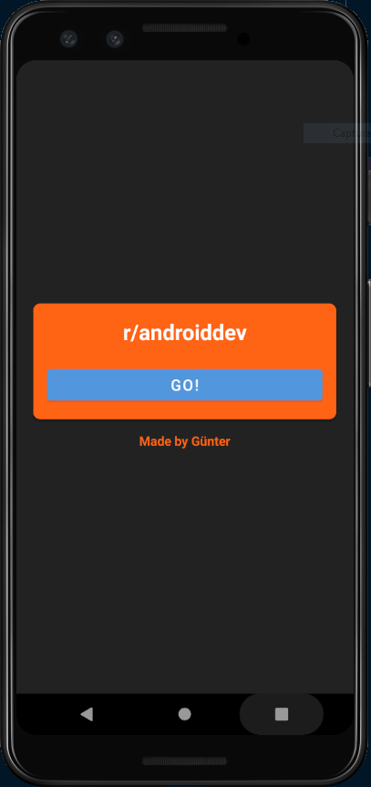
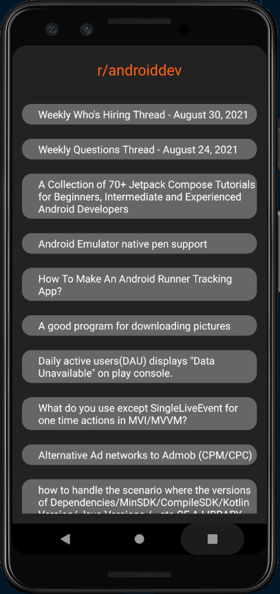

# RedditAPI_Android
 Aplicativo que utiliza a API do reddit para coletar títulos de postagens do subreddit r/androiddev, e exibí-los.

---------------------------------------------------------------------------------------------------------------------

### Screenshots

